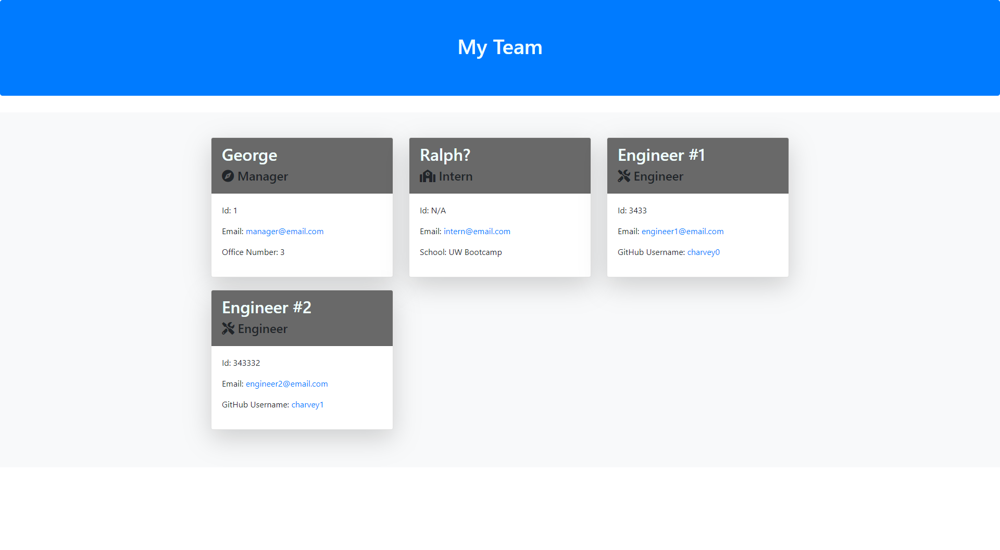

# Team-Roster

  

# Table of Contents
* [Project Description](#project-description)
* [Installation](#installation)
* [Usage](#usage)
* [Tests](#tests)
* [License](#license)
* [Contributions](#contributions)
* [Questions](#questions)

# Project Description
This app is intended to collect contact information of team members and organize it in a easy to reference layout.
    
# Installation
 1. Clone this repo  
 2.  Open **index.js** in the console.   
 3. type **npm i** in the command line.

# Usage
This app allows a manager to enter contact information about her or his team and generates an HTML file ( "team.html" ) to be opened and used by the manager the next time he/she needs to get in touch with a team member.

# Tests
In the console, type "npm run test" to check that all classes, Team, Employee, Intern, Manager and Engineer are constructed properly and methods are working properly.

# License
MIT

# Contributions
Thank you for your interest in contributing.  You can fork this project and adapt it to fit your needs.

# Questions
If you have any questions, please contact the project owner by clicking on the email listed below.  
     
#### GitHub username: [charvey0](https://github.com/charvey0)
#### Email address: [charvey0@gmail.com](mailto:charvey0@gmail.com)
